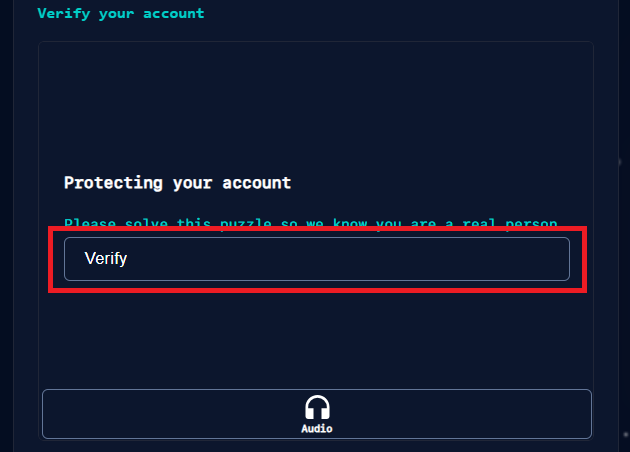
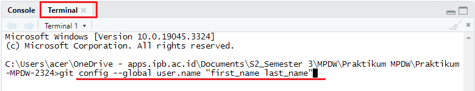
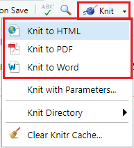
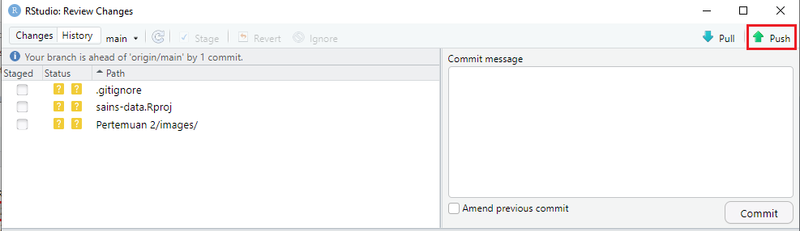
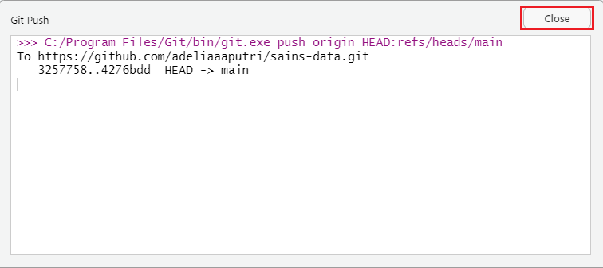

### Mendownload Git

Download Git pada link berikut [Download Git](https://git-scm.com/downloads) lalu install Git.

### Membuat Akun GitHub

Buka GitHub pada link berikut [GitHub](https://github.com/). Klik sign up yang terdapat pada pojok kanan atas.

{width="474"}

Klik `Sign in` pada pojok kanan atas halaman jika sudah memiliki akun GitHub sebelumnya. Jika belum memiliki akun GitHub, masukkan email dan klik `Continue`.

{width="631"}

Masukkan password lalu klik `Continue`.

{width="576"}

Masukkan username lalu klik `Continue`.

{width="472"}

Selanjutnya, jika ingin mendapatkan informasi mengenai update dan pengumuman lainnya, maka ketik "y" lalu klik `Continue`, sebaliknya jika tidak maka ketik "n" lalu klik `Continue`.

{width="474"}

Lakukan verifikasi dengan memilih `Verify` lalu lakukan sesuai dengan petunjuk yang diberikan.

{width="479"}

Jika verifikasi sudah berhasil dilakukan, klik `Create account`.

{width="487" height="74"}

Buka email, lalu masukkan kode otp yang dikirimkan melalui email.

{width="491"}

Jawab beberapa pertanyaan yang di ajukan lalu klik `Continue`.

{width="391"}

Klik `Continue for free` yang terletak pada bagian kiri bawah halaman.

{width="507"}

### Integrasi Git, GitHub dan RStudio

Buka RStudio, lalu pilih menu `Tools` dan klik `Global Options`.

{width="269"}

Pilih menu `Git/SVN`, masukkan file git.exe pada git executable lalu klik `Apply` dan klik `OK`

{width="491"}

### Koneksi Akun GitHub pada RStudio

Pada tab `Terminal`, ketik perintah berikut untuk konfigurasi nama

{width="664"}

Selanjutnya, ketik perintah berikut untuk konfigurasi alamat email

{width="581" height="42"}

Pada saat clone repositori, pengguna akan diminta untuk memasukkan password sebagai verifikasi akun yang terhubung agar kemudian dapat melakukan proses manajemen kode yang ada di lokal pengguna dan server GitHub.

### Membuat Repository

Pilih menu create new pada bagian kanan atas halaman GitHub lalu klik `New repository`.

{width="538"}

Masukkan nama repository dan deskripsinya. Selanjutnya pilih apakah respository akan dibuat publik (semua orang dapat melihat) atau privat (dapat memilih siapa saja yang dapat melihat). Ceklis Add a README file lalu klik `Continue`.


Selanjutnya klik `Create repository` yang terdapat pada bagian bawah


### Clone Repository

Proses duplikasi repositori ke lokal tempat dimana kita bekerja yaitu dengan membuat proyek baru pada RStudio dengan cloning alamat repositori yang sudah dibuat sebelumnya. Untuk melakukannya, buka RStudio dan pilih menu `File` yang ada di pojok kiri atas lalu pilih `New Project`.

{width="233"}

Untuk menyambungkan dengan GitHub, pilih `Version Control`.

{width="368"}

Selanjutnya pilih `Git`. Untuk melakukan clone repository, dibutuhkan repository url yang sebelumnya telah dibuat di GitHub.

{width="363"}

Buka GitHub dan pilih `Code` yang berada di bagian sebelah kanan atas, lalu salin link seperti yang tertera pada gambar.

{width="301"}

Masukkan link yang telah disalin ke bagian repository url, pilih folder tempat penyimpanan project baru dan klik `Create project`

{width="383"}

### Membuat Folder Baru pada Repository GitHub dan Memperbaharuinya di R

Untuk membuat folder baru pada repository GitHub, Buka GitHub, pilih `Add file` yang terdapat pada bagian kanan atas lalu klik `Create new file`.

{width="306"}

Tulis nama folder yang akan dibuat di repository GitHub, bubuhkan tanda miring `/` lalu buat file baru, dalam hal ini akan dibuat file dalam bentuk R markdown sehingga file baru yang dibuat memiliki ekstensi Rmd

{width="541"}

Untuk memperbaharui RStudio agar file yang baru dibuat dapat dimunculkan, pilih menu `Git` pada bagian kanan atas, lalu pilih menu `Pull` dan klik `Pull with Rebase`.

{width="395"}

Folder serta file yang sebelumnya telah dibuat di repository github, akan muncul pada bagian file RStudio. Untuk melihat file yang dibuat dalam folder tersebut, klik folder yang ingin dibuka

{width="393"}

Untuk membuka file dalam folder tersebut, klik file yang ingin dibuka pada folder yang dimaksud

{width="403"}

### Sekilas Tentang R Markdown

```{r}
x=3+2
x
```

R Markdown memiliki ekstensi Rmd. Untuk membuat judul dalam Rmd, gunakan tanda pagar `#` seperti yang tertera pada baris pertama gambar di bawah. Semakin banyak jumlah pagar `#` maka akan semakin kecil tulisan judul yang dibuat, begitupun sebaliknya. Untuk menulis sebuah kalimat/penjelasan, dapat ditulis seperti biasa seperti yang tertera pada baris ke 3. Untuk menulis syntax R, gunakan petik (\`) sebanyak 3 kali diikuti dengan {r} seperti yang tertera pada baris ke 5 gambar dibawah. Untuk mengakhiri penulisan syntax, kembali gunakan petik sebanyak 3 kali, seperti yang tertera pada baris ke 8 gambar di bawah. Untuk menjalankan syntax R yang telah dibuat, klik panah berwarna hijau yang terletak pada sisi sebelah kanan syntax baris pertama. Output dari syntax akan keluar tepat dibawah tempat syntax dituliskan.

{width="487"}

Untuk menambahkan gambar pada file Rmd, klik `Visual` lalu klik ikon gambar pada sisi atas

{width="491"}

Masukkan direktori tempat gambar yang akan dimasukkan berada lalu klik `OK`

{width="295"}

Untuk menyimpan Rmd dalam bentuk HTML, PDF ataupun Word, klik `knit` pada bagian atas, lalu pilih bentuk file yang diinginkan.

{width="137"}

### Memperbaharui file dalam GitHub

Untuk memperbaharui file dalam GitHub yang sebelumnya telah diedit di RStudio, lakukan `Ctrl+S` lalu pilih menu `Git` pada bagian kanan, ceklis file yang baru diperbaharui, lalu klik `Commit`

{width="399"}

Ceklis file yang baru diperbaharui, masukkan pesan pembaharuan pada bagian commite message, lalu klik `commit`

{width="528"}

Setelah file yang baru diperbaharui hilang, klik `push` untuk mengunggah file ke GitHub.

{width="528"}

Selanjutnya akan muncul jendela baru, dan ketika push selesai dijalankan, klik `close`

{width="478"}

File yang diperbaharui di RStudio selanjutnya akan muncul di GitHub setelah GitHub di refresh

{width="448"}
